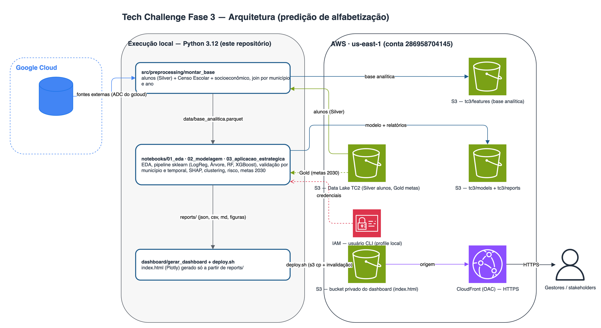

# TECH CHALLENGE FASE 3 — Predição e Inteligência Analítica para Alfabetização no Brasil

**Autor:** Theo Coleone de Camargo
**Curso:** Pós-Graduação — AI Scientist — FIAP

**Dashboard:** https://dv2nlyojecknt.cloudfront.net
**Vídeo executivo:** _(a gravar)_

> Continuação do Tech Challenge Fase 2: consome a camada **Gold** do data lake construído lá
> (Arquitetura Medalhão no S3) e desenvolve um modelo supervisionado de Machine Learning, além
> de uma leitura estratégica por município.

---

## 1. Contexto do problema

A alfabetização na idade certa é um marco do desenvolvimento educacional. O **Compromisso Nacional
Criança Alfabetizada** estabelece que toda criança deve estar alfabetizada até o fim do 2º ano do
Ensino Fundamental, com horizonte de meta em 2030. Uma criança é considerada alfabetizada a partir de
**743 pontos na escala de proficiência do Saeb** (INEP).

Compreender apenas os números atuais não basta: gestores precisam **antecipar risco**, identificar
territórios vulneráveis e entender **quais fatores** mais pesam no resultado. É onde a Ciência de Dados
transforma dado público em inteligência aplicada à decisão.

## 2. Objetivo analítico

Duplo, em dois grãos:

1. **Modelo supervisionado (grão aluno):** classificação binária — prever se um aluno é
   *alfabetizado* (1) ou *não alfabetizado* (0) a partir de variáveis educacionais, territoriais e
   socioeconômicas.
2. **Aplicação estratégica (grão município):** responder às perguntas de negócio — quais fatores mais
   impactam, quais municípios são de maior risco, quais regiões têm padrões semelhantes e quantos
   municípios tendem a não atingir a meta de 2030.

## 3. Descrição da base utilizada

- **Base de treino:** microdados por aluno da avaliação de alfabetização (`silver/alunos`, **3.867.999
  linhas**, 2023–2024), herdada do TC2 (S3, conta `286958704145`). Alvo = coluna `alfabetizado` (0/1).
- **Enriquecimento externo** (via BigQuery / Base dos Dados):
  - **Censo Escolar (INEP)** — infraestrutura, docentes e matrículas, **agregados por município** (o
    `id_escola` do SAEB é anonimizado e não casa com o código INEP — ver Limitações).
  - **Atlas do Desenvolvimento Humano (PNUD)** — IDHM e subíndices, renda per capita, Gini, pobreza,
    saneamento, analfabetismo adulto.
  - **IBGE** — população e PIB per capita municipal.
  - **Diretório IBGE** — região, mesorregião, Amazônia Legal, capital.
- **Base analítica final:** 50 colunas no grão aluno (join por `id_municipio` e território).
- **Tratamento de data leakage (crítico):** foram **excluídas** todas as variáveis medidas no exame ou
  derivadas do alvo — `proficiencia`, `presenca`, `preenchimento_caderno`, e os agregados
  `taxa_alfabetizacao`/`media_portugues` etc. Usá-las treinaria o modelo sobre o próprio resultado.

## 4. Etapas de modelagem

1. **Análise exploratória** (`notebooks/01_eda.py`): distribuições, nulos, correlações e desigualdades.
2. **Pipeline Scikit-learn** (`src/modeling/pipeline.py`): `ColumnTransformer` com imputação (mediana
   nas numéricas), **One-Hot** nas categóricas e **padronização** — tudo `fit` só no treino (anti-leakage).
3. **Split estratificado** 80/20 (`stratify`, `random_state=42`) + **Stratified K-Fold (5)**.
4. **Otimização** via `RandomizedSearchCV` (subamostra para velocidade) e refit na base de treino cheia.
5. **Avaliação** no conjunto de teste intocado + **interpretabilidade** (SHAP + importâncias).

> Para tratabilidade em 3,87M de linhas, o treino usa uma **amostra estratificada de 800k** (registrada
> no código) — não altera as conclusões dado o teto de sinal do problema.

## 5. Escolha do algoritmo

Quatro modelos comparados (ROC-AUC no teste): **XGBoost 0,673** > Random Forest 0,672 > Regressão
Logística 0,642 > Árvore 0,629. **Campeão: XGBoost** (boosting), tunado por RandomizedSearchCV — captura
o efeito não-linear de UF (ex.: o descolamento do Ceará) melhor que os modelos lineares.

## 6. Métricas de avaliação

Classe 0 = *não alfabetizado* (a de interesse para intervenção). Campeão no teste:

| Métrica | Valor |
|---|---|
| Acurácia | 0,62 |
| ROC-AUC | 0,67 |
| F1-macro | 0,62 |
| Recall (não alfabetizado) | 0,59 |
| AUC-PR | 0,68 |

Alvo balanceado (~51%/49%). Figuras: `reports/figuras/07_confusao_campeao.png`, `08_roc_campeao.png`.

## 7. Interpretação dos resultados

Por **SHAP** e importâncias (`09_shap_summary.png`), a **geografia domina**: `sigla_uf` (Bahia e Ceará
como maiores drivers), `nome_regiao` e `amazonia_legal` lideram — **nenhuma variável socioeconômica
contínua entra no top-15**. A localização (qual UF/região) é o principal preditor do resultado individual.

## 8. Insights encontrados

- **Desigualdade regional acentuada:** Norte 42% → Centro-Oeste 55% de alfabetização.
- **Ceará é outlier positivo (82%)** enquanto Bahia, RN e Sergipe ficam na base (~30–33%) — evidência do
  peso da **política pública** (o PAIC cearense) sobre o contexto socioeconômico.
- **"Dois Brasis" (clustering):** municípios se separam nitidamente em um grupo vulnerável (taxa 0,51;
  IDHM 0,59; pobreza 41%) e um desenvolvido (taxa 0,60; IDHM 0,71; pobreza 10%).
- **Metas 2030 em risco:** ~**49,6% dos municípios não atingem a meta** mantendo a tendência 2023→2024.

## 9. Limitações do projeto

- **Sinal individual limitado (features ecológicas):** sem atributos por aluno/escola, prever o
  indivíduo a partir de contexto agregado tem teto baixo (ROC-AUC ~0,67). O valor está na interpretação
  e na leitura municipal, onde a agregação evidencia os padrões.
- **`id_escola` anonimizado:** o SAEB alfabetização não traz o código INEP, impedindo features por escola
  (Censo Escolar entrou agregado por município).
- **Rótulo:** alunos ausentes na avaliação constam como não alfabetizados (ausência ≠ analfabetismo).
- **Defasagem temporal:** Atlas ADH é de 2010 (covariável estrutural).
- **Série curta:** apenas 2023–2024 → projeção de metas por extrapolação de tendência (ARIMA/SARIMA
  descartados por insuficiência amostral).

## 10. Aplicação prática para políticas públicas

- **Priorização de recursos** nos municípios do cluster vulnerável e no topo do ranking de risco.
- **Difusão de boas práticas:** estudar e replicar o modelo cearense (PAIC) nos estados de menor taxa.
- **Monitoramento de metas:** acompanhar os ~50% de municípios fora da rota de 2030 e agir antes da
  próxima avaliação, em vez de reagir depois.

## 11. Possíveis evoluções futuras

- Obter o **crosswalk `id_escola` → INEP** para features reais por escola (grande potencial de sinal).
- Séries históricas mais longas para modelagem temporal adequada.
- **Target encoding** fold-safe de município para capturar variação geográfica fina.
- Novas fontes: FUNDEB, PNAD Contínua, Cadastro Único.
- **MLOps:** treino no SageMaker Pipelines, monitoramento de drift e retreinamento.

---

## Arquitetura e reprodução



```
tech-challenge-3/
├── data/            # base completa (gitignored, vive no S3) + amostra.parquet versionada
├── docs/            # dicionario_dados.md
├── notebooks/       # 01_eda · 02_modelagem · 03_aplicacao_estrategica
├── src/
│   ├── preprocessing/  # ingestão S3 + BigQuery, montagem da base
│   ├── modeling/       # pipeline (ColumnTransformer) + treino/tuning
│   ├── evaluation/     # métricas, gráficos e agregados para o dashboard
│   └── visualization/
├── dashboard/       # gerar_dashboard.py → index.html; deploy.sh + configs S3/CloudFront
├── reports/         # métricas (JSON/CSV) e figuras
├── images/          # fluxograma dos serviços AWS
├── requirements.txt
└── requirements-cloud.txt
```

**Setup e execução (da raiz do repo):**
```bash
python3.12 -m venv .venv && source .venv/bin/activate
pip install -r requirements.txt

# Acesso ao data lake (opcional — só para montar a base completa):
#   AWS: profile fiap-tech-challenge (conta 286958704145, us-east-1)
#   GCP: gcloud auth application-default login
#        export GCP_BILLING_PROJECT=<projeto que fatura as queries no BigQuery>
python -m src.preprocessing.montar_base       # S3 + BigQuery -> data/base_analitica.parquet

python notebooks/01_eda.py                    # análise exploratória + agregados do dashboard
python notebooks/02_modelagem.py              # treino, tuning, avaliação, SHAP
python notebooks/03_aplicacao_estrategica.py  # clustering, risco, projeção de metas (Gold no S3)
python dashboard/gerar_dashboard.py           # index.html a partir de reports/ (sem dados brutos)
bash dashboard/deploy.sh                      # publica no S3 + CloudFront
```

Sem credenciais, os scripts usam automaticamente `data/amostra.parquet` (municípios inteiros
sorteados por UF); EDA e modelagem rodam ponta a ponta, com números diferentes da base completa.
A projeção de metas em `03` lê a Gold no S3 e é pulada sem acesso.

**Nuvem:** dados/artefatos no **S3**, treino no **SageMaker**, dashboard servido via **CloudFront**
(bucket privado com OAC). Fluxo: `BigQuery → S3 (features) → SageMaker → S3 (models/reports) → dashboard → CloudFront`.
