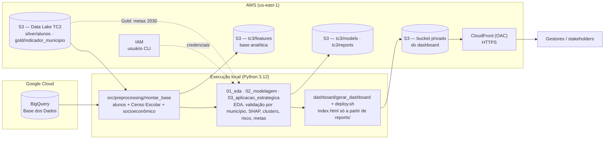
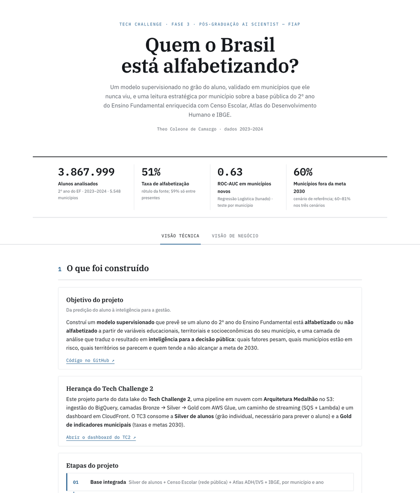
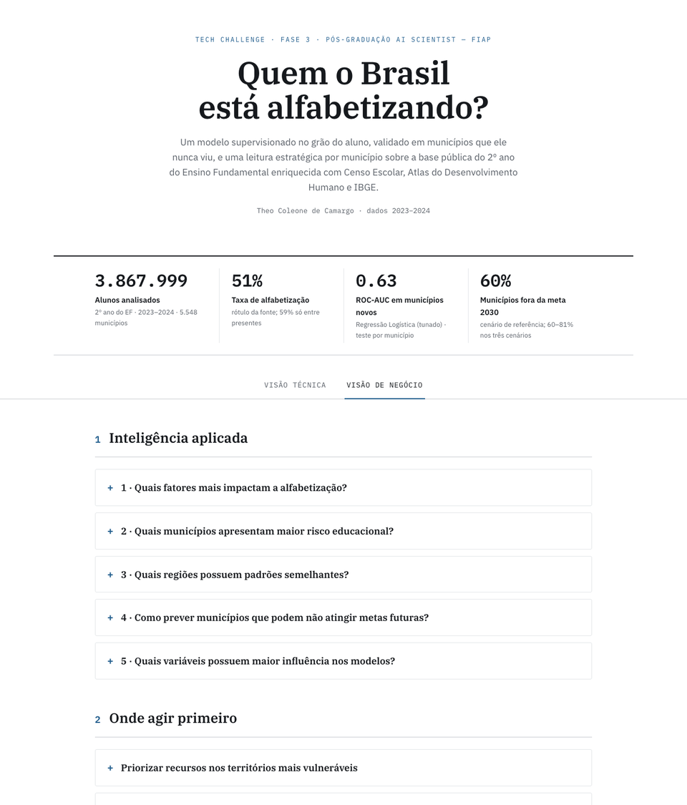

# TECH CHALLENGE FASE 3 — Predição e Inteligência Analítica para Alfabetização no Brasil
**Autor:** Theo Coleone de Camargo  
**Curso:** Pós Graduação - AI Scientist - FIAP  
**Dashboard:** https://dv2nlyojecknt.cloudfront.net  
**Vídeo executivo:** https://youtu.be/pLPCehpBoLE

---

## 1. Objetivo do Projeto

Este projeto é a continuação do Tech Challenge Fase 2: consome o data lake construído lá (Arquitetura
Medalhão no S3) e desenvolve um modelo supervisionado de Machine Learning que prevê se um aluno do 2º
ano do Ensino Fundamental está **alfabetizado** ou **não alfabetizado**, a partir de variáveis
educacionais, territoriais e socioeconômicas. Sobre o modelo, uma camada de aplicação estratégica
traduz o resultado em inteligência para a gestão pública, no grão do município.

**Foco:**
- Construir uma pipeline completa de ML (imputação, transformação, engenharia de atributos, tratamento de data leakage) integrada ao modelo
- Validar o modelo em municípios que ele nunca viu, porque as features são municipais e é assim que ele seria usado
- Explicar o que pesa na predição (SHAP e coeficientes) em vez de só reportar métricas
- Responder às perguntas de negócio: fatores, municípios de risco, regiões semelhantes, metas de 2030
- Entregar tudo reproduzível, com artefatos versionados e um dashboard publicado

---

## 2. Entendimento do Problema

### 2.1 Qual problema está sendo resolvido?

A alfabetização na idade certa é um marco do desenvolvimento educacional. O **Compromisso Nacional
Criança Alfabetizada** estabelece que toda criança deve estar alfabetizada até o fim do 2º ano do
Ensino Fundamental, com meta de 80% em 2030. Uma criança é considerada alfabetizada a partir de **743
pontos na escala Saeb** (INEP).

Saber os números atuais não basta: o gestor precisa **antecipar risco**, identificar territórios
vulneráveis e entender **quais fatores** pesam no resultado. Na Fase 2 os dados foram integrados; na
Fase 3 eles passam a gerar predição e priorização.

### 2.2 Por que prever, e não só medir?

A avaliação acontece uma vez por ano e o resultado chega depois. Um modelo que usa o contexto do
município (escolas, renda, pobreza, território) permite estimar risco antes da próxima medição,
ordenar municípios por urgência e simular cenários para a meta de 2030. E, quando o modelo erra para
um município específico, o erro também informa: aponta um fator local que o contexto não explica.

### 2.3 Quais áreas se beneficiam desses insights?

| Área | Benefício |
|------|-----------|
| Secretarias estaduais e municipais de Educação | Priorizar recursos nos municípios do perfil vulnerável e no topo do ranking de risco, em vez de distribuir de forma uniforme |
| MEC / INEP | Acompanhar a rota para a meta de 2030 com cenários por município e identificar onde falta dado confiável |
| Redes municipais e escolas | Usar o corte de decisão do modelo para busca ativa de alunos em risco (recall de 71%) |
| Pesquisa e avaliação de políticas | Base analítica integrada (aluno + Censo Escolar + Atlas ADH + IBGE) e um protocolo de validação que separa sinal de memória de território |

### 2.4 Perguntas de negócio

| Pergunta | Onde é respondida |
|----------|-------------------|
| Quais fatores mais impactam a alfabetização? | Dashboard, aba de negócio, item 1 · seção 8 |
| Quais municípios apresentam maior risco educacional? | Item 2 · seção 9 · `reports/risco_municipios.csv` |
| Quais regiões possuem padrões semelhantes? | Item 3 · seção 9 · `reports/perfil_clusters.json` |
| Como prever municípios que podem não atingir metas futuras? | Item 4 · seção 9 · `reports/metas_2030_municipios.csv` |
| Quais variáveis possuem maior influência nos modelos? | Item 5 · seção 8 · `reports/shap_por_variavel.json` |

---

## 3. Fontes de Dados e Base Analítica

### 3.1 Fontes

| Fonte | Origem | Conteúdo | Grão |
|-------|--------|----------|------|
| SAEB Alfabetização (Silver do TC2) | S3 `silver/alunos` | 3.867.999 alunos, 2023–2024; alvo `alfabetizado`, `presenca`, rede, UF, município | aluno |
| Censo Escolar (INEP) | BigQuery / Base dos Dados | Infraestrutura, docentes, matrículas e salas das **escolas públicas** de anos iniciais | município × ano |
| Atlas do Desenvolvimento Humano (PNUD) | BigQuery | IDHM e subíndices, renda, Gini, pobreza, saneamento, analfabetismo adulto (2010) | município |
| IVS (Ipea) | BigQuery | Índice de Vulnerabilidade Social e dimensões (2010) | município |
| IBGE | BigQuery | População e PIB per capita (2023); diretório com região, Amazônia Legal, capital | município |
| Gold do TC2 | S3 `gold/indicador_municipio` | Taxa por município e ano, metas 2030 — usada só na camada estratégica | município × ano |

O `id_escola` do SAEB é anonimizado e não casa com o código INEP, por isso o Censo Escolar entra
agregado por município e ano, e não por escola.

### 3.2 Base analítica

**49 colunas no grão aluno**, join por `id_municipio` (e `ano`, no Censo), 100% de cobertura. Colunas
medidas no exame ou derivadas do alvo (proficiência, preenchimento do caderno, agregados da Gold)
ficam fora por vazarem o resultado. `presenca` é carregada só para definir população e checar
sensibilidade, nunca como feature. Dicionário completo em
[`docs/dicionario_dados.md`](docs/dicionario_dados.md).

### 3.3 O que a análise exploratória mostrou

Resumo completo, com tabelas e as hipóteses H1–H6, em [`reports/eda_resumo.md`](reports/eda_resumo.md).

- **Todo aluno ausente está rotulado como não alfabetizado.** Presença de 86,8%; taxa de 51,3% com o
  rótulo da fonte, **59,1% só entre presentes**. A Gold do TC2 usa a taxa entre presentes (diferença
  média de 1,1 p.p.), a definição do indicador oficial.
- **AC, DF e SP só existem em 2024** na Silver (484 mil alunos). A comparação anual e a variável `ano`
  ficam confundidas com a composição de UFs.
- **Variações anuais extremas por mecanismos distintos:** RS caiu 14,8 p.p. com presença estável e
  taxa entre presentes indo de 64,7% para 45,7%; SC caiu 4,7 p.p. por queda de presença (78,6% →
  70,1%) com resultado entre presentes estável.
- **O contexto socioeconômico pesa pouco no indivíduo:** correlações |r| < 0,15 e taxa plana acima do
  3º decil de IDHM. UF separa muito mais (CE 82% vs RN 30%).
- **342 municípios têm menos de 50 alunos** avaliados nos dois anos; taxas instáveis.

---

## 4. Arquitetura da Solução

A execução é local, em Python 3.12; dados de entrada, base analítica, modelo e relatórios ficam no
Amazon S3; o dashboard estático fica em um bucket privado servido pelo CloudFront com Origin Access
Control. As fontes externas vêm do BigQuery (Base dos Dados).




### 4.1 Execução local

`montar_base` lê a Silver de alunos no S3 e as fontes externas no BigQuery, faz os joins por
município e ano e grava `data/base_analitica.parquet` (229 MB) e `s3://…/tc3/features/`. Os três
scripts de `notebooks/` leem a base local e gravam tudo em `reports/` e `models/`. O dashboard é
gerado só a partir de `reports/` e `images/`, sem tocar em dado bruto.

### 4.2 Dados e artefatos no S3

| Prefixo | Conteúdo | Quem grava |
|---------|----------|------------|
| `silver/alunos`, `gold/indicador_municipio` | Data lake do TC2 (leitura) | Glue do TC2 |
| `tc3/features/base_analitica.parquet` | Base analítica, 3.867.999 × 49 | `montar_base` |
| `tc3/models/campeao.joblib` | Pipeline completo do modelo campeão (13 KB) | `02_modelagem` |
| `tc3/reports/*` | 25 artefatos: métricas, CV, tuning, SHAP, clusters, risco, metas, resumo da EDA | `02_modelagem`, `03_aplicacao_estrategica` |

### 4.3 Dashboard

Bucket `fiap-tc3-dashboard-286958704145` privado, com bucket policy que só aceita o CloudFront
(`dashboard/bucket-policy.json`); distribuição com OAC e redirecionamento para HTTPS
(`dashboard/cloudfront-config.json`); publicação por `dashboard/deploy.sh` (upload + invalidação).

---

## 5. Etapas de Modelagem

### 5.1 Pipeline e engenharia de atributos

`src/modeling/pipeline.py` monta um `Pipeline` Scikit-learn com três passos, ajustado só no treino:

1. `FunctionTransformer` com a **engenharia de atributos** (`src/modeling/features.py`): alunos por
   docente, matrículas por sala, escolas por 10 mil habitantes, log de população e de PIB per capita.
2. `ColumnTransformer`: mediana + padronização nas numéricas; constante + One-Hot nas categóricas
   (rede, UF, região, Amazônia Legal, capital).
3. O estimador.

O modelo salvo (`models/campeao.joblib`) recebe as colunas brutas da base e faz tudo internamente.

### 5.2 Tratamento de data leakage

- Colunas medidas no exame ou derivadas do alvo ficam em `COLUNAS_LEAKAGE` (`src/config.py`);
  `separar_features` falha se alguma sobrar entre as features. `ano` fica fora.
- Como quase todas as features são municipais, **treino e teste são separados por município**
  (`GroupShuffleSplit`). Com split aleatório de alunos, o modelo é avaliado em territórios que já
  conhece e o ROC-AUC sobe artificialmente.

### 5.3 Protocolo de validação

1. **Seleção por validação cruzada:** `StratifiedGroupKFold(5)` com folds por município, quatro
   algoritmos (Regressão Logística, Árvore de Decisão, Random Forest, XGBoost), média ± desvio.
2. **Tuning dos dois melhores** com `RandomizedSearchCV` (15 iterações, 3 folds por município); o
   baseline de cada um é mantido se vencer.
3. **Teste tocado uma única vez** pelo campeão final, em 1.109 municípios nunca vistos.
4. **Robustez:** o mesmo modelo com split aleatório de alunos e com validação temporal (treino 2023 →
   teste 2024).
5. **Corte de decisão** para a classe não alfabetizado e **interpretabilidade** (SHAP e coeficientes).

Para tratabilidade, o treino usa uma **amostra estratificada de 800 mil alunos** (todos os
municípios continuam representados); a validação cruzada roda em 300 mil e o tuning em 200 mil.

---

## 6. Escolha do Algoritmo

Validação cruzada por município (ROC-AUC, média de 5 folds ± desvio):

| Modelo | Validação | Treino | Distância treino → validação |
|--------|-----------|--------|------------------------------|
| **Regressão Logística** | **0,630 ± 0,013** | 0,642 | 0,012 |
| Random Forest | 0,625 ± 0,012 | 0,688 | 0,063 |
| XGBoost | 0,623 ± 0,017 | 0,689 | 0,066 |
| Árvore de Decisão | 0,599 ± 0,019 | 0,633 | 0,034 |

**Campeã: Regressão Logística** (L2, `C = 0,0115` após tuning; 0,6278 vs 0,6272 do baseline em CV).
Random Forest tunada ficou em 0,6262. O resultado inverte a intuição inicial: os modelos de árvore
chegavam a **0,67** no split aleatório de alunos porque **memorizavam municípios** (treino 0,69 vs
validação 0,62); em municípios novos, o modelo linear regularizado generaliza igual ou melhor, com
um quinto da distância entre treino e validação, e se explica por coeficientes.

---

## 7. Métricas de Avaliação

Classe 0 = *não alfabetizado* (a de interesse para intervenção). Alvo balanceado (51/49).

### 7.1 Teste em municípios nunca vistos

138.576 alunos de 1.109 municípios fora do treino:

| Métrica | Teste | Treino |
|---------|-------|--------|
| ROC-AUC | **0,633** | 0,642 |
| Acurácia | 0,595 | 0,601 |
| F1-macro | 0,594 | 0,601 |
| Recall (não alfabetizado) | 0,568 | 0,585 |
| Precisão (não alfabetizado) | 0,584 | 0,592 |
| AUC-PR | 0,645 | 0,653 |

### 7.2 Robustez

| Protocolo | ROC-AUC | Leitura |
|-----------|---------|---------|
| Teste por município (referência) | 0,633 | Generalização para território novo |
| Split aleatório por aluno | 0,643 | A diferença de 0,009 mede quanto o modelo dependia de reconhecer o município |
| XGBoost, split aleatório vs por município | 0,672 vs 0,623 | No boosting a diferença é 0,05: memória de território, não sinal |
| Temporal: treino 2023 → teste 2024 | 0,619 | 0,645 sem AC, DF e SP, que não existem em 2023 |

### 7.3 Corte de decisão

Com 0,50 o modelo recupera 57% dos não alfabetizados; com **0,55** recupera **71%** ao custo de
precisão (56% vs 58%) e de sinalizar 62% dos alunos em vez de 47%. O corte é uma escolha de gestão
(busca ativa vs custo de triagem), não do modelo.

Figuras: `reports/figuras/07_confusao_campeao.png`, `08_roc_campeao.png`, `18_threshold.png`.
Artefatos: `reports/cv_modelos.json`, `tuning.json`, `metricas_campeao.json`, `treino_vs_teste.json`,
`comparacao_split.json`, `validacao_temporal.json`, `threshold.json`.

---

## 8. Interpretação dos Resultados

Por **SHAP** (somado por variável original, `reports/shap_por_variavel.json`): **UF** concentra 33%
da influência das 15 variáveis mais importantes, 3,3 vezes a segunda colocada. Depois vêm **porte do
município** (log da população e nº de escolas), **IDHM renda**, **% de pobres**, **analfabetismo
adulto**, **IVS capital humano** e **região**. Infraestrutura escolar aparece atrás (% de escolas com
quadra, matrículas por escola).

Nos coeficientes, as maiores magnitudes são de UFs: **Ceará** (+1,60, positivo, o maior de todos),
**RN** (−0,81), **BA** e **SE** (−0,63), GO (+0,53) e PR (+0,44). Sinais individuais de variáveis
correlacionadas (população e nº de escolas, IDHM e pobreza) devem ser lidos em conjunto: em um
modelo linear regularizado eles se compensam. A leitura robusta é a de magnitude — geografia
primeiro, porte e renda depois, escola por último.

---

## 9. Principais Descobertas

- **Desigualdade regional:** Norte 42% → Centro-Oeste 55%; UFs de 30% (RN) a 82% (CE).
- **Ceará é um caso de política pública, não de contexto:** IDHM médio-baixo, 82% de alfabetizados,
  o maior coeficiente positivo do modelo. Evidência do peso da ação consistente (PAIC) sobre o
  contexto socioeconômico.
- **Memória de território não é sinal:** a vantagem do boosting desaparecia ao trocar o split
  aleatório pelo split por município. Sem essa validação, o projeto teria escolhido o modelo errado.
- **Dois perfis de município** (clustering, silhouette 0,31 — estrutura fraca, um corte do gradiente
  de IDHM): *vulnerável* (2.368 municípios; taxa 51%, IDHM 0,59, 41% de pobres, 70% de escolas rurais;
  1.686 no Nordeste e 345 no Norte) e *desenvolvido* (3.180; taxa 60%, IDHM 0,71, 10% de pobres; SP,
  MG, RS, PR). Com k = 3 surge um grupo intermediário (1.840 municípios; MG, RS, PR, GO).
- **Risco municipal:** os 20 municípios de menor indicador em 2024 (entre 4.393 com ≥ 50 alunos e
  participação ≥ 50%) têm de 11% a 19% de alfabetizados entre presentes, contra 62% na média dos
  municípios; 13 estão no Nordeste e 5 no Tocantins (Pedrinhas-SE, Dirceu Arcoverde-PI,
  Filadélfia-TO, Arataca-BA...). O risco previsto pelo modelo tem correlação de −0,74 com o indicador
  observado; quando os dois divergem, o problema é local, não estrutural.
- **Metas 2030 em risco:** entre 4.271 municípios com dado confiável, **59,6%** (2.547) não atingem a
  meta no cenário de referência (tendência própria encolhida para a da UF, variação anual limitada a
  ±5 p.p.), em média 13 p.p. abaixo; 81,0% se mantiverem a taxa de 2024 e 66,1% seguindo a tendência
  da UF.
- **1.155 municípios ficaram fora do ranking** por falta de dado confiável em 2024 (1.114 com menos
  de 50 alunos, 29 sem avaliação, 12 com participação abaixo de 50%).

---

## 10. Aplicação Prática para Políticas Públicas

- **Priorizar** os municípios do perfil vulnerável e o topo do ranking de risco, em vez de distribuir
  recursos de forma uniforme.
- **Replicar o que funciona:** estudar e adaptar o modelo cearense nos estados da base do ranking.
- **Monitorar as metas** com cenários: os 2.547 municípios fora da rota de 2030 no cenário de
  referência são a lista de acompanhamento (`reports/metas_2030_municipios.csv`).
- **Garantir a avaliação** onde falta dado confiável: sem medição não há gestão.
- **Usar o corte de decisão como política:** recall de 70% para busca ativa, corte padrão para triagem.

---

## 11. Decisões Técnicas e Trade-offs

| Decisão | Alternativa descartada | Por quê |
|---------|------------------------|---------|
| Treinar no grão aluno com a Silver | Treinar na Gold (grão município) | O guideline pede prever o aluno; a Gold tem ~5,5 mil linhas e responde outra pergunta |
| Rótulo `alfabetizado` da fonte | Recalcular de `proficiencia ≥ 743` | Exigiria carregar a variável que vaza o alvo; o rótulo é o indicador que o gestor recebe |
| `presenca` só como filtro | Usar como feature / ignorar | Filtro de população não vaza; feature vaza |
| Censo Escolar por município, só rede pública | Join por escola / todas as redes | `id_escola` anonimizado; alunos avaliados são da rede pública |
| Split e CV por município | Split aleatório por aluno | Features municipais: alunos do mesmo município não são independentes |
| `ano` fora das features | Manter | Confundido com UF (AC/DF/SP só em 2024) e inútil para prever um ano novo |
| Tuning dos dois melhores, baseline mantido se vencer | Tunar só o primeiro | Diferença pequena entre finalistas; evita escolher por ruído |
| Regressão Logística como campeã | XGBoost (melhor no split aleatório) | Melhor em municípios novos, um quinto do gap treino/validação, explicável por coeficientes |
| Amostra de 800 mil alunos | Base completa | Sinal individual satura; tuning viável localmente |
| Ranking pela taxa entre presentes, com filtros | Taxa com ausentes, sem filtro | Mesma definição da Gold; município com 0% e 410 alunos era não participação |
| Cenários de meta com limite de ±5 p.p./ano | Extrapolação linear de um ano | A reta produzia gaps de ±600 p.p.; um ano não é tendência |
| Dashboard gerado só de `reports/` | Ler o parquet na geração | Qualquer pessoa regenera o dashboard sem acesso ao data lake |

---

## 12. Dashboard

O dashboard estático (Plotly) tem duas abas. A **visão técnica** mostra o que foi construído, o que a
EDA revelou, a comparação de modelos com treino e validação, os protocolos de validação, a matriz de
confusão, a curva ROC, o corte de decisão, a interpretabilidade e a arquitetura. A **visão de
negócio** responde às cinco perguntas do desafio com os gráficos e tabelas que as sustentam (SHAP por
variável, os 20 municípios de maior risco, os perfis de município, os cenários para 2030, os
coeficientes) e fecha com "onde agir primeiro".

**https://dv2nlyojecknt.cloudfront.net**

Todo o conteúdo vem de `reports/` e `images/`; nenhum dado bruto é lido na geração, então qualquer
pessoa com o repositório regenera o mesmo HTML. Bucket privado com OAC, HTTPS pelo CloudFront.

---

## 13. Como Reproduzir os Resultados

**Pré-requisitos:** Python 3.12 | opcional: credenciais AWS (profile `fiap-tech-challenge`, conta
286958704145, us-east-1) e um projeto GCP com BigQuery habilitado, só para montar a base completa.

```bash
# 1. Clonar e preparar o ambiente
git clone https://github.com/theocoleone/tech-challenge-3.git && cd tech-challenge-3
python3.12 -m venv .venv && source .venv/bin/activate
pip install -r requirements.txt

# 2. (opcional) Autenticar no GCP e montar a base completa: S3 + BigQuery -> data/base_analitica.parquet e tc3/features
gcloud auth application-default login
export GCP_BILLING_PROJECT=<projeto que fatura as queries no BigQuery>
python -m src.preprocessing.montar_base

# 3. Análise exploratória: figuras, reports/eda_resumo.md e agregados do dashboard
python notebooks/01_eda.py

# 4. Modelagem: CV por município, tuning, teste único, robustez, SHAP (+ tc3/models e tc3/reports no S3)
python notebooks/02_modelagem.py

# 5. Aplicação estratégica: clusters, ranking com filtro de participação, cenários 2030 (lê a Gold no S3)
python notebooks/03_aplicacao_estrategica.py

# 6. Dashboard: index.html a partir de reports/ e images/
python dashboard/gerar_dashboard.py

# 7. Publicar no S3 + CloudFront
bash dashboard/deploy.sh
```

Sem credenciais, os scripts usam `data/amostra.parquet` (149 municípios inteiros sorteados por UF,
61.726 alunos): EDA, modelagem e dashboard rodam ponta a ponta, com números diferentes dos da base
completa. A projeção de metas em `03` lê a Gold no S3 e é pulada sem acesso. `TC3_BASE=<caminho>`
força um parquet específico. Os artefatos versionados em `reports/` são os da base completa.

```
tech-challenge-3/
├── data/            # base completa (gitignored, vive no S3) + amostra.parquet versionada
├── docs/            # dicionario_dados.md
├── notebooks/       # 01_eda · 02_modelagem · 03_aplicacao_estrategica
├── src/
│   ├── config.py       # caminhos, bucket, alvo, COLUNAS_LEAKAGE
│   ├── data_access.py  # S3 (Parquet particionado), BigQuery, publicação de artefatos
│   ├── preprocessing/  # ingestão S3 + BigQuery, montagem da base, amostra
│   ├── modeling/       # features.py (atributos derivados) + pipeline.py (ColumnTransformer)
│   ├── evaluation/     # métricas, scorers, gráficos, agregados para o dashboard
│   └── visualization/
├── models/          # campeao.joblib (pipeline completo, 13 KB)
├── dashboard/       # gerar_dashboard.py → index.html; deploy.sh + configs S3/CloudFront
├── reports/         # métricas (JSON/CSV), eda_resumo.md, figuras
├── images/          # fluxograma (drawio + png) e evidências
└── requirements.txt
```

---

## 14. Evidências de Execução na Nuvem

Registros feitos em 15/09/2026 pela CLI (`aws`, com o profile do projeto) e por captura do dashboard
publicado. As imagens ficam em `images/evidencias/`.

**Dashboard publicado (HTTPS via CloudFront)**





**Artefatos no S3 (`aws s3 ls s3://fiap-tc2-286958704145/tc3/ --recursive --human-readable`)**

```
2026-09-15 14:45:01  218.9 MiB  tc3/features/base_analitica.parquet
2026-09-15 16:53:45   12.3 KiB  tc3/models/campeao.joblib
2026-09-15 16:53:46    3.4 KiB  tc3/reports/agregados_base.json
2026-09-15 16:53:47    3.6 KiB  tc3/reports/cv_modelos.json
2026-09-15 16:53:48    9.2 KiB  tc3/reports/eda_resumo.md
2026-09-15 16:44:46  523.6 KiB  tc3/reports/metas_2030_municipios.csv
2026-09-15 16:53:48  252 Bytes  tc3/reports/metricas_campeao.json
2026-09-15 16:44:51  346.1 KiB  tc3/reports/risco_municipios.csv
2026-09-15 16:53:51  506 Bytes  tc3/reports/shap_por_variavel.json
2026-09-15 16:53:52  655 Bytes  tc3/reports/tuning.json
...                              (25 artefatos em tc3/reports/)
```

**Distribuição CloudFront (`aws cloudfront get-distribution --id E2KTJLYG9E06DQ`)**

| Campo | Valor |
|-------|-------|
| Domínio | dv2nlyojecknt.cloudfront.net |
| Status | Deployed |
| Origem | fiap-tc3-dashboard-286958704145.s3.us-east-1.amazonaws.com |
| Origin Access Control | EMEU8G9WDDUX4 |
| Política de viewer | redirect-to-https |

O bucket do dashboard só tem o `index.html` (1,2 MiB) e aceita leitura apenas do CloudFront
(`dashboard/bucket-policy.json`). O bucket de dados permanece privado e separado.

---

## 15. Fluxo de Trabalho no Git

O desenvolvimento seguiu feature branches com Pull Requests para a `main`:

| PR | Entrega |
|----|---------|
| [#1](https://github.com/theocoleone/tech-challenge-3/pull/1) | Ingestão, EDA, modelagem, aplicação estratégica e dashboard (primeira versão funcional) |
| [#2](https://github.com/theocoleone/tech-challenge-3/pull/2) | Reprodutibilidade (imports, artefatos versionados, dashboard só de `reports/`) e consistência código/documentação |
| [#3](https://github.com/theocoleone/tech-challenge-3/pull/3) | Base analítica v2 (presença, Censo só rede pública), amostra versionada e EDA com hipóteses |
| [#4](https://github.com/theocoleone/tech-challenge-3/pull/4) | Validação por município, tuning dos finalistas, estratégia com cenários, dashboard e README finais |

As mensagens de commit descrevem a intenção da mudança e as descrições dos PRs registram o porquê,
o que muda e como foi validado. A entrega está marcada com a tag `v1.0-entrega`.

---

## 16. Dicionário de Dados

Linguagem de negócio para as 49 colunas da base analítica, por grupo. O detalhe coluna a coluna, com
fonte, ano de referência e unidade, está em [`docs/dicionario_dados.md`](docs/dicionario_dados.md).

| Grupo | Colunas | Origem |
|-------|---------|--------|
| Identificação | `id_aluno`, `id_municipio`, `nome_municipio`, `ano` | SAEB (Silver do TC2) |
| Alvo e população | `alfabetizado` (0/1, rótulo da fonte), `presenca` (só filtro) | SAEB |
| Categóricas do modelo | `rede` (2 estadual, 3 municipal, 4 privada), `sigla_uf`, `nome_regiao`, `amazonia_legal`, `capital_uf` | SAEB, diretório IBGE |
| Contexto escolar (`esc_*`) | nº de escolas públicas, % rurais, % com água, energia, esgoto, internet, banda larga, biblioteca, laboratórios, quadra, refeitório, alimentação, área verde, pátio; médias de docentes, matrículas e salas por escola | Censo Escolar (município × ano) |
| Socioeconômico | IDHM e subíndices, renda per capita, Gini, pobreza, analfabetismo adulto, frequência líquida, água encanada, energia, coleta de lixo, expectativa de vida, IVS e dimensões, população, PIB per capita | Atlas ADH e IVS (2010), IBGE (2023) |
| Derivadas no Pipeline | alunos por docente, matrículas por sala, escolas por 10 mil hab., log de população e de PIB per capita | `src/modeling/features.py` |

---

## 17. Limitações e Riscos

- **Teto de sinal no grão aluno:** sem atributos do aluno ou da escola, prever o indivíduo a partir do
  contexto municipal rende ROC-AUC ~0,63. O valor está na interpretação e na leitura municipal.
- **Rótulo:** ausentes contam como não alfabetizados (13% da base). O modelo aprende o indicador que o
  gestor recebe; a sensibilidade está documentada e a camada municipal filtra participação.
- **Cobertura da Silver:** AC, DF e SP sem 2023 (a Gold do TC2 tem o indicador municipal de 2023 para
  SP, então o gap está nos microdados). Sem painel aluno a aluno: `id_aluno` é anonimizado por edição.
- **`id_escola` anonimizado:** Censo Escolar entra agregado por município; a principal perda de
  features do projeto.
- **Defasagem:** Atlas ADH e IVS são de 2010.
- **Série curta:** dois anos. A projeção de metas é um conjunto de cenários limitados, não uma
  previsão; a diferença de um único ano não é tendência (RS e SC mostram isso).
- **Clusters fracos:** silhouette 0,31; a tipologia é indicativa.
- **Correlação não é causalidade:** coeficientes e SHAP descrevem associações condicionais no modelo,
  não efeitos causais.

---

## 18. Possíveis Evoluções Futuras

- Crosswalk `id_escola` → INEP para features reais por escola.
- Mais edições da avaliação para modelagem temporal adequada e validação temporal completa.
- Target encoding de município fold-safe, avaliado com o mesmo protocolo por grupo.
- Novas fontes: FUNDEB, PNAD Contínua, Cadastro Único, Censo 2022 (substituir o ADH 2010).
- Retreinamento anual automatizado com o mesmo `Pipeline` e monitoramento de drift a cada nova edição da avaliação.

---

## 19. Apresentação

[](https://youtu.be/pLPCehpBoLE)

**Vídeo executivo:** https://youtu.be/pLPCehpBoLE

O vídeo simula uma reunião executiva com gestores públicos: o problema educacional, o que os dados
mostram, como o modelo foi construído e validado, as respostas às cinco perguntas de negócio sobre o
dashboard e onde agir primeiro.
